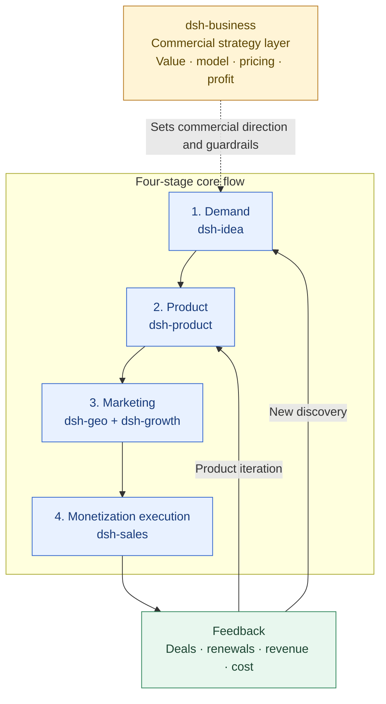

# dsh-business

English | [中文](./README.zh.md)

商业策略与商业化插件，覆盖商业模式、定价与渠道价盘、盈利能力、电梯 Pitch 和商业计划。

Evidence-backed business strategy and commercialization tools for business models, pricing architecture, channel economics, profitability, elevator pitches and business plans.

Public six-plugin collaboration contract: [SUITE.md](https://github.com/winyh/dsh-business/blob/main/SUITE.md).

## Plugin Positioning: Cross-Cutting Commercial Strategy Layer

`dsh-business` is not the execution plugin for the monetization stage. It is the commercial strategy layer that spans demand, product, marketing and monetization, turning customer value, product capability, target segments and operating results into an explainable business model, pricing architecture and path to profitability.

- **Owns:** Business models, value propositions, product/package design, pricing architecture, channel economics, contribution margin, profitability, elevator pitches and business plans.
- **Across the flow:** Evaluates opportunity value in the demand stage, constrains value and scope in the product stage, defines positioning and channel economics in marketing, and sets pricing, offer and profit boundaries in monetization.
- **Inputs:** Opportunities and target users from `dsh-idea`, product scope and PMF evidence from `dsh-product`, acquisition/conversion data from `dsh-geo` and `dsh-growth`, and offer/close feedback from `dsh-sales`.
- **Outputs:** Business model canvases, pricing and packaging recommendations, channel unit economics, profitability hypotheses, business plans and value/offer boundaries for sales.
- **Does not own:** Demand discovery, product delivery, marketing content execution, sales follow-up or CRM operations. It provides commercial judgment and rules; the relevant plugin or team executes them.

## Positioning Architecture: Commercial Strategy Layer + Four-Stage Core Flow

The six plugins work together to turn a real demand signal into a deliverable product, reach target customers through marketing, and use monetization results to drive product iteration or discover new opportunities.

`dsh-business` answers: **“Why will customers buy, what should we sell, how should we price it, and is each deal becoming healthier?”** It does not occupy one stage; it provides commercial judgment across all four stages. Monetization data, pricing objections, discounts, losses and renewals feed back to [dsh-product](../dsh-product/README.md) for product iteration and to [dsh-idea](../dsh-idea/README.md) for new demand discovery.

## Collaboration Handoffs

| Business touchpoint | What this plugin provides | Collaborators |
| --- | --- | --- |
| Demand evaluation | Turn an opportunity into value propositions, revenue hypotheses and business model options | [dsh-idea](../dsh-idea/README.md), [dsh-product](../dsh-product/README.md) |
| Product definition | Design packaging, price ladders, cost/margin targets and commercialization gates | [dsh-product](../dsh-product/README.md) |
| Marketing design | Define positioning, value communication, channel choices and acquisition economics | [dsh-geo](../dsh-geo/README.md), [dsh-growth](../dsh-growth/README.md) |
| Monetization execution | Provide offer, discount, profit boundaries and sales strategy | [dsh-sales](../dsh-sales/README.md) |
| Results feedback | Adjust strategy using close, loss, renewal and unit-economics evidence | [dsh-product](../dsh-product/README.md), [dsh-idea](../dsh-idea/README.md) |

All business tool results use the shared result envelope with `ok`, `data`, `warnings`, `assumptions`, `lineage` and `nextActions`. The `lineage` field is populated from source-backed evidence when available, so commercial decisions can be traced back to the supplied material.

`business_commercial_handoff` turns a pricing review and optional profitability review into a versioned `commercial-handoff` for `dsh-sales` or `dsh-product`. It reports calculated facts and required approvals only; it never approves a price, discount or revenue commitment.

## Plugin Navigation

| Plugin | Clear responsibility | Direct link |
| --- | --- | --- |
| dsh-idea | External opportunities, demand signals, candidate directions and smallest useful tests | [README](../dsh-idea/README.md) |
| dsh-product | Product definition, POC/MVP, release gates and PMF | [README](../dsh-product/README.md) |
| dsh-business | Cross-cutting commercial strategy, value, pricing and profitability (this plugin) | [README](./README.md) |
| dsh-sales | Monetization execution: qualification, deal progression, closing, expansion and renewal | [README](../dsh-sales/README.md) |
| dsh-growth | Acquisition, activation, retention, revenue analysis and growth experiments | [README](../dsh-growth/README.md) |
| dsh-geo | SEO/GEO/AEO, content production and search/answer-engine discoverability | [README](../dsh-geo/README.md) |

## Scope

Start here when the question is about how to make money, what to package, whether pricing is sound, which channels are profitable, or how to build a business plan. For “is this worth doing?”, start with [dsh-idea](../dsh-idea/README.md); for “what product should we build and how do we validate PMF?”, use [dsh-product](../dsh-product/README.md); for “how do we build traffic and revenue?”, use [dsh-growth](../dsh-growth/README.md).
