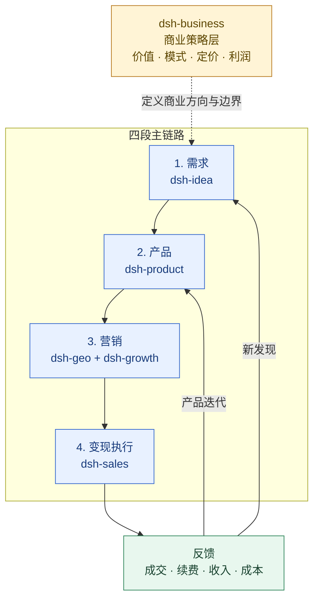

# dsh-business

中文 | [English](./README.md)

商业策略与商业化插件，覆盖商业模式、定价与渠道价盘、盈利能力、电梯 Pitch 和商业计划。

六插件公开协作契约：[SUITE.md](https://github.com/winyh/dsh-business/blob/main/SUITE.md)。

`business_artifact_index` 扫描项目中的结构化工件，`business_artifact_review` 校验交接工件的稳定 ID、内容指纹和有效期；`business_loop_review` 检查六个阶段是否形成可执行闭环。

## DSH 基座兼容与安装

已适配 DeepSeek Harness **0.1.5-rc.2**（2026-09-22 核对的 npm `latest` 通道）及 Cordis 4.0.2。Node.js 要求为 `^22.19.0 || >=24.0.0`。DSH peer 依赖锁定为本次验证版本，其他发布通道需要重新验证兼容性。

```sh
npm install -g @deepseek-ai/dsh@0.1.5-rc.2
dsh --version
dsh plugin --profile web add github:winyh/dsh-business
dsh --profile web --dump-config
dsh web
```

插件应安装到实际启动的 profile：使用 `dsh web` 时安装到 `web`；自定义 profile 则统一替换命令中的名称。安装到 `default` 不会在 `web` 中启用。更新后重启正在运行的 profile。

GitHub 源码安装通过 `prepare` 构建入口。如果 pnpm 阻止构建，请先审阅代码，再将它提示的准确包名加入该 profile 的 `pnpm-workspace.yaml` 的 `allowBuilds`，然后重试。需要可重复部署时固定已审阅的 Git 提交。也可以先运行 `pnpm pack`，再使用 `dsh plugin --profile web add ./package.tgz` 安装已构建的包。

profile 提供 `tools` 和 `fs` 服务。私有 `docs/` 文档继续排除在 Git 和发布包之外。

维护者运行 `pnpm install --frozen-lockfile` 后执行 `pnpm run verify`，即可完成类型检查、lint、单元测试、构建、包结构检查，以及 `plugin:runtime:validate`。运行验证通过 Cordis Loader 加载构建后的插件和真实 DSH 服务，检查工具可见性、文件读取、参数与输出校验、取消请求和卸载清理，无需 API Key。

## 插件定位：贯穿主链路的商业策略层

`dsh-business` 不是“变现”阶段的执行插件，而是贯穿需求、产品、营销和变现的商业策略层：把客户价值、产品能力、目标客群和经营结果，转成可解释的商业模式、定价与盈利路径。

- **主责：** 商业模式、价值主张、产品/套餐、价格架构、渠道经济性、贡献毛利、盈利性、电梯 Pitch 和商业计划。
- **作用范围：** 在需求阶段评估机会价值，在产品阶段约束价值与范围，在营销阶段定义定位与渠道经济，在变现阶段制定价格、报价和利润边界。
- **不负责：** 不替代需求发现、产品交付、营销内容执行、销售跟进或 CRM 操作；执行分别交给对应插件或团队。

## 定位架构：商业策略层 + 四段主链路



变现结果、价格异议、折扣、丢单和续约信号会反馈到 `dsh-product` 迭代产品，也会反馈到 `dsh-idea` 识别新需求。

所有商业工具结果都使用统一结果包：`ok`、`data`、`warnings`、`assumptions`、`lineage` 和 `nextActions`。`lineage` 用来追溯价格、成本和商业判断的来源。

`business_commercial_handoff` 会把定价复盘和可选的盈利复盘转成版本为 `1.0` 的 `commercial-handoff`，交给 `dsh-sales` 或 `dsh-product` 审查。它只报告计算事实和待审批项，不批准价格、折扣或收入承诺。

## 插件导航

| 插件 | 分工 | 直接跳转 |
|---|---|---|
| `dsh-idea` | 外部机会、需求信号、候选方案和最小验证 | [README](../dsh-idea/README.zh.md) |
| `dsh-product` | 产品定义、POC/MVP、发布门槛和 PMF | [README](../dsh-product/README.zh.md) |
| `dsh-business` | 横跨全链路的商业策略、价值、定价和盈利 | [README](./README.zh.md) |
| `dsh-sales` | 变现执行：资格判断、商机推进、成交、扩单和续约 | [README](../dsh-sales/README.zh.md) |
| `dsh-growth` | 获客、激活、留存、收入分析和增长实验 | [README](../dsh-growth/README.zh.md) |
| `dsh-geo` | SEO/GEO/AEO、内容生产和搜索/答案引擎可发现性 | [README](../dsh-geo/README.zh.md) |

## 工具

- `business_model_review`
- `business_pricing_review`
- `business_profitability_review`
- `business_elevator_pitch`
- `business_plan`

插件只基于用户提供的事实、假设和数据生成结构化结果，不虚构市场规模、客户数量、收入或增长证据。
